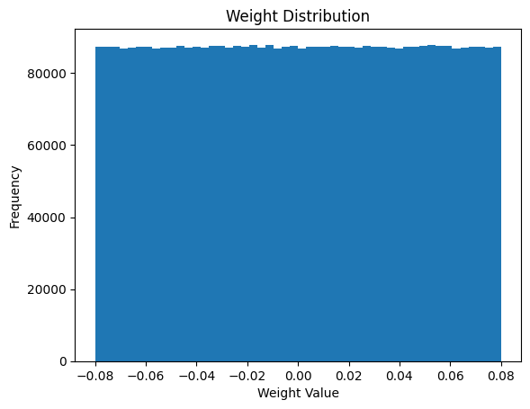
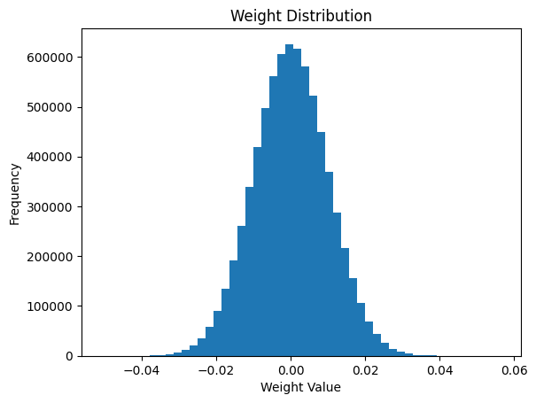
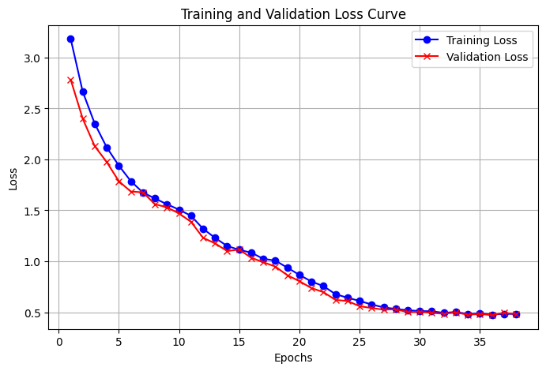
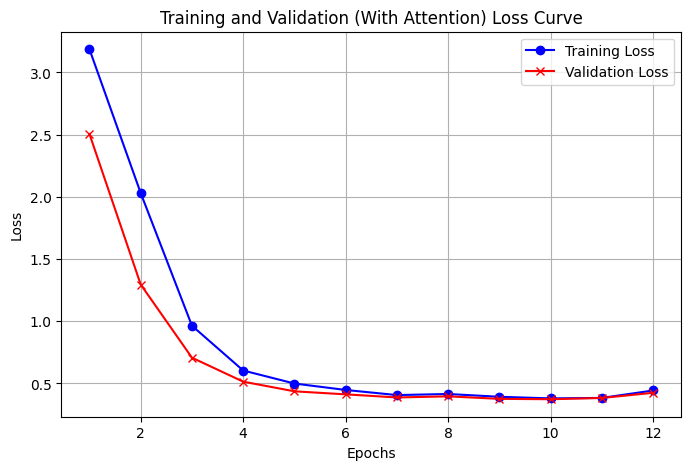
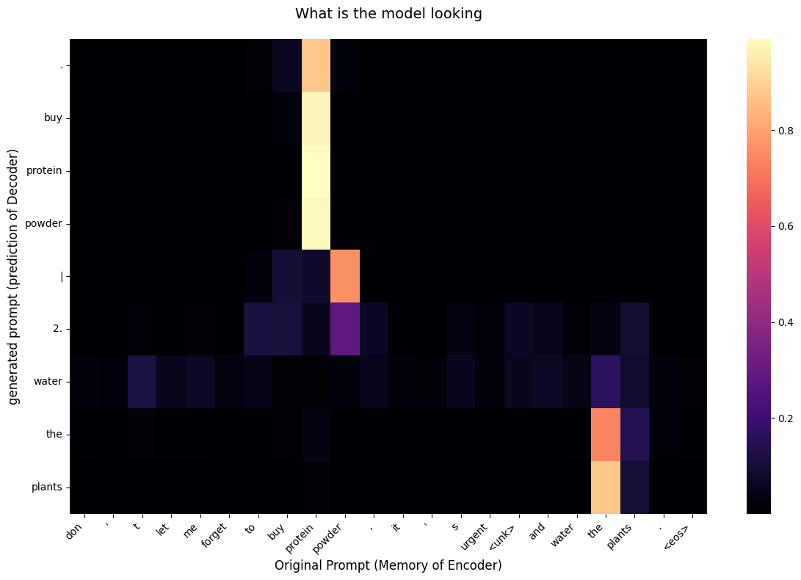

# PyTorch Reimplementation of Fundamental Seq2Seq Architectures

This repository contains a from-scratch PyTorch reimplementation of two milestone papers that shaped modern Deep Learning and NLP:

(synthetic dataset has been used due to constraint computational resources without GPU)

* **The Baseline:** [Sequence to Sequence Learning with Neural Networks](https://arxiv.org/abs/1409.3215) (Sutskever et al., 2014)
* **The Attention Mechanism:** [Neural Machine Translation by Jointly Learning to Align and Translate](https://arxiv.org/abs/1409.0473) (Bahdanau et al., 2014)

## Project Objective
The purpose of this side project is to build, train, and mathematically compare both architectures to understand how the "context bottleneck" problem is solved. The performance of both models is evaluated and compared using industry-standard metrics such as [BLEU](https://en.wikipedia.org/wiki/BLEU) and [ROUGE](https://en.wikipedia.org/wiki/ROUGE_(metric)).

## Architectural Differences Explored
* **The Baseline Seq2Seq:** Utilizes a standard Unidirectional Long Short-Term Memory (LSTM) network, forcing the encoder to compress all information into a single fixed-size vector. 
* **Seq2Seq with Attention:** Implements a Bidirectional Gated Recurrent Unit (GRU) combined with Bahdanau Attention, allowing the decoder to dynamically "look back" at specific parts of the source sentence during translation.

By implementing the attention mechanism, the model's performance improves significantly, breaking the context bottleneck and eliminating hallucinations on longer sequences.

## Difference in Weight Initialization
* **The Baseline Seq2Seq:** Following the original Seq2Seq paper, weights were initialized from a uniform distribution between -0.08 and 0.08.

* **Seq2Seq with Attention:** As stated in the paper, weights are initialized using uniform/Gaussian scaling distributions to prevent exploding or vanishing gradients caused by the `tanh` activation function.

## Difference in Gradient Descent
As seen in both loss curves:

* **The Baseline Seq2Seq:** The baseline model requires more epochs (stopping at epoch 37 via early stopping) to reach a loss plateau of ~0.494, indicating that the model without attention needs more training time to converge and learn the statistical patterns of the dataset.

* **The Attention Seq2Seq:** In contrast, the attention model reaches a loss plateau much faster (around epoch 12). Thanks to the attention mechanism and bidirectional GRU, it learns the statistical patterns of the dataset more efficiently.

## Performance Comparison

| Metric | Baseline Seq2Seq | Seq2Seq with Attention |
| :--- | :---: | :---: |
| **BLEU Score** | ~0.84 | ~0.91 |
| **ROUGE-1** | ~0.876 | ~0.944 |
| **ROUGE-2** | ~0.845 | ~0.937 |
| **ROUGE-L** | ~0.876 | ~0.943 |

---

## The Attention Matrix
Below is the attention matrix demonstrating how the model dynamically aligns with the original prompt during inference. 

> **Note:** The heatmap visualizes the attention weights in real-time. Notice how the model focuses its attention exactly on specific source entities (like "water" and "plants") strictly when generating their corresponding target tokens, successfully ignoring padded or irrelevant information.
