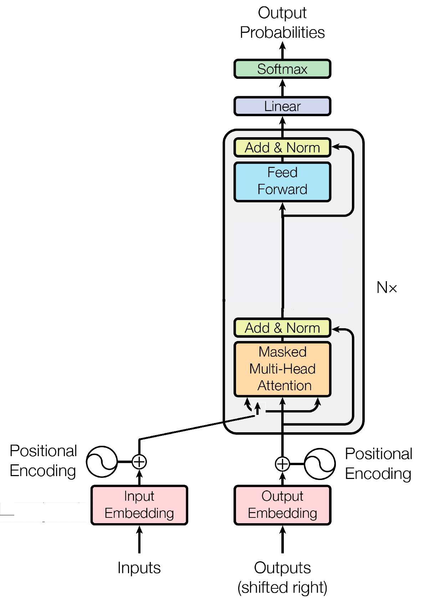
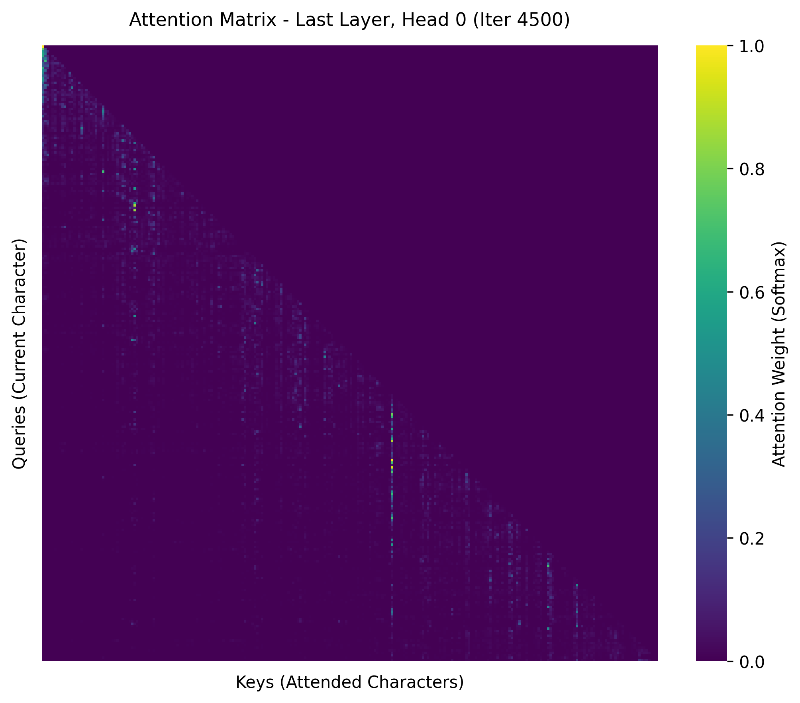
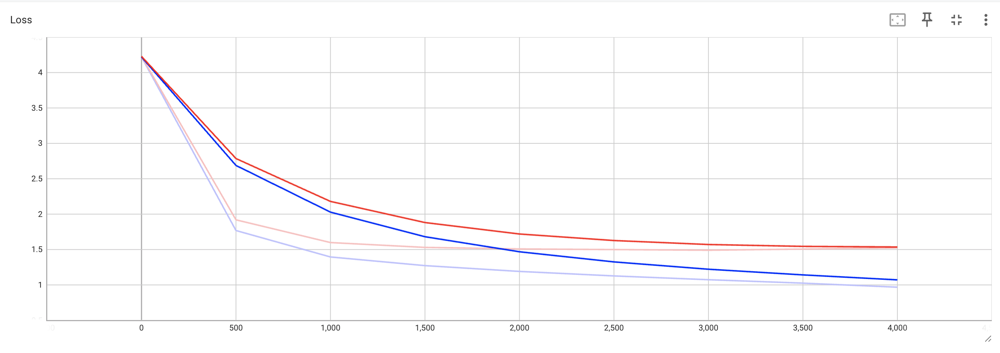

# PyTorch Reimplementation of "Attention Is All You Need" (Decoder-only GPT)

This directory contains a PyTorch reimplementation based on the paper [Attention Is All You Need](https://arxiv.org/abs/1706.03762) (Vaswani et al., 2017) and Andrej Karpathy's video tutorial:

*Reference: [Let's build GPT: from scratch](https://www.youtube.com/watch?v=kCc8FmEb1nY)*

This project re-implements a Generative Pre-trained Transformer (GPT) architecture. It focuses on a strictly decoder-only model designed for next-token prediction using a dataset of William Shakespeare's works. The resulting model features 11 million parameters and was trained leveraging an *NVIDIA L4 GPU.*

## Decoder Architecture

The model utilizes a Decoder-only Transformer architecture:

Instead of the traditional encoder-decoder structure, this implementation consists of:
* Token and Positional Embeddings
* Masked Multi-Head Self-Attention
* Feed-Forward Neural Networks
* Layer Normalization and Residual Connections
* A final Linear projection layer with a Softmax activation for output probabilities

## Explanation

In this model architecture (introduced by OpenAI in 2022), they used pre-training with large chunks of data from the internet for the model to learn the statistical patterns of the dataset and get a general insight into what token to predict next based on the tokens before. As shown in the video and proyect, this is only the pre-trained form, so it is not good at having a conversation—it is only good for making next-token predictions using a causal mask with a softmax layer.

It has 11M parameters, so it is not like the smallest version of GPT (which has ~124M parameters). Its main purpose is understanding how the attention mechanism and parallel computation work in Google Colab. The model learned how to predict each token from the William Shakespeare dataset and how to understand the statistical patterns of this text.

## Attention Matrix

As shown in the visualization, a causal mask is used in the Multi-Head Attention (MHA) block to restrict the model from attending to future positions during training

When the softmax layer assigns high probability to specific keys, distinct vertical streaks (green/yellow) emerge, signaling concentrated attention weights across the context window

## Training and Validation Loss

As shown in the loss plot (blue for training, red for validation), the training loss converges steadily over time. Meanwhile, the validation curve begins to show slight signs of overfitting, which triggered the EarlyStopping callback to halt training and preserve the best model checkpoint.