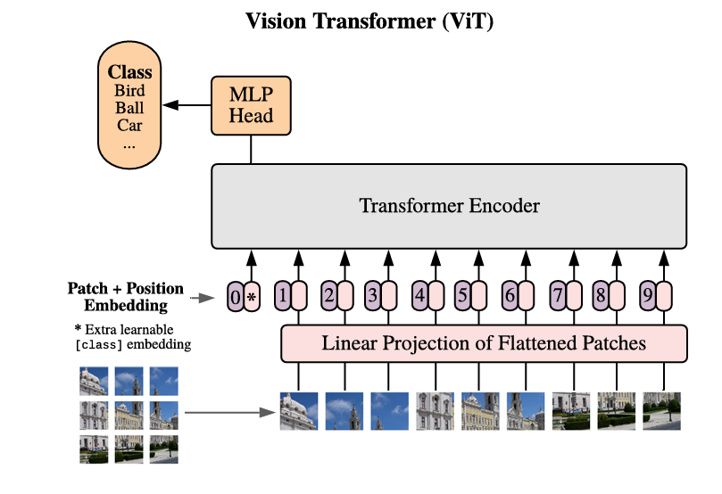
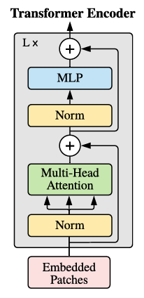
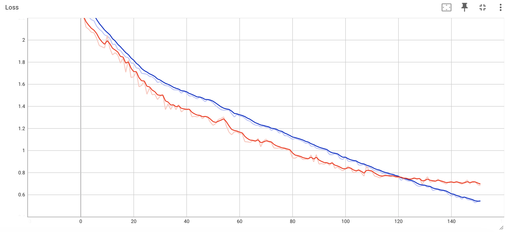
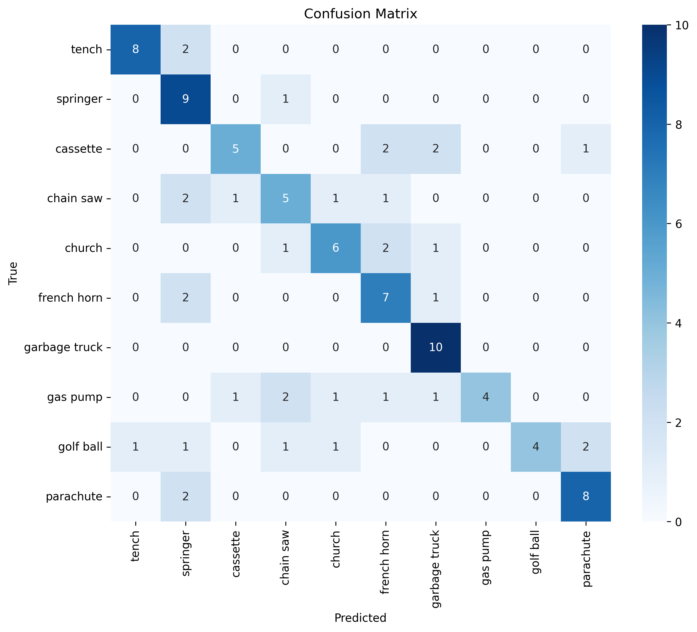
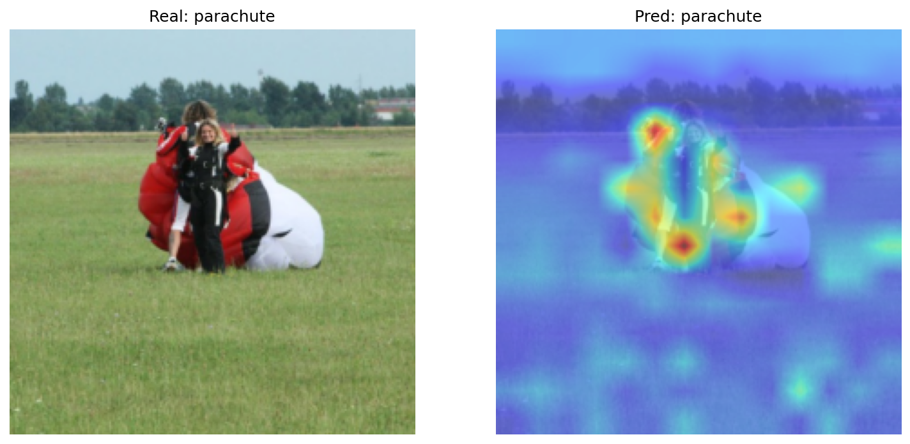
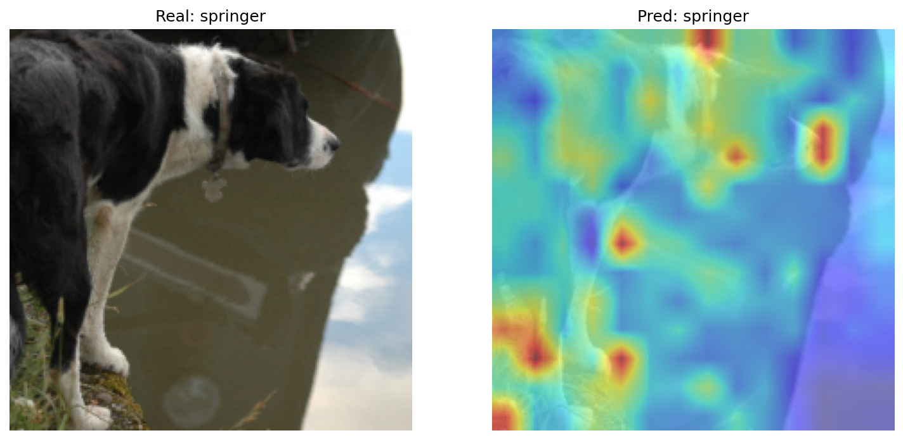
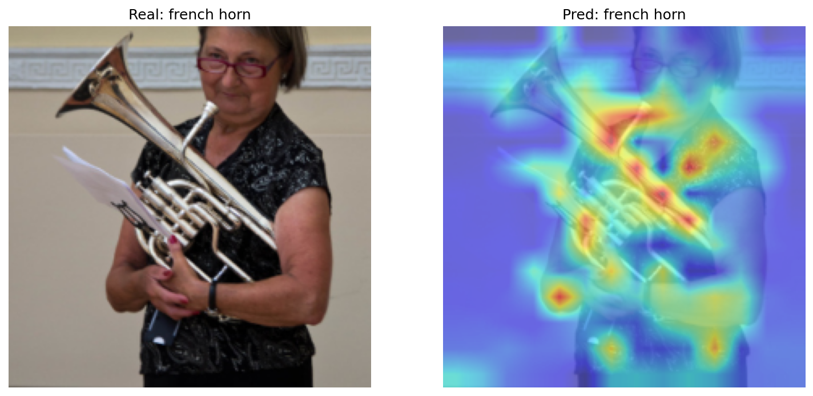
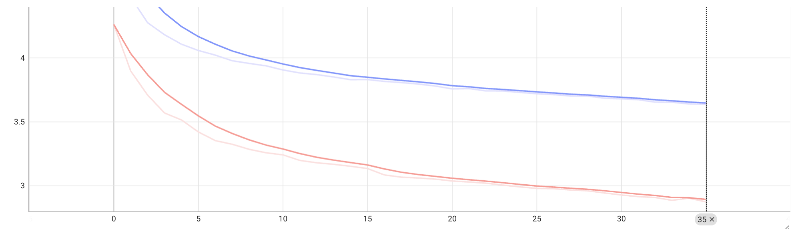

# PyTorch Reimplementation of "An Image is Worth 16x16 Words: Transformers for Image Recognition at Scale" (ViT Encoder-Only)

This directory contains a PyTorch reimplementation based on the paper [An Image Is Worth 16×16 Words](https://arxiv.org/abs/2010.1192) (Dosovitskiy et al. 2020).

This project reimplements a pre-trained and fine-tuned Vision Transformer (Encoder-only architecture). It focuses on the methodology described in Section 3 of the paper. This pre-trained model is designed for classifying 10 classes from the [imagenette2](https://www.kaggle.com/datasets/adityakane/imagenette2) dataset using the `[CLS]` token. 

The resulting model features around *21.5 million* parameters and was pre-trained and fine-tuned leveraging an *NVIDIA L4 GPU*.

## Image Processing / Patch Embedding
The standard Transformer receives as input a 1D sequence of token embeddings. To handle 2D images, the image $x \in \mathbb{R}^{H \times W \times C}$ is reshaped into a sequence of flattened 2D patches $x_p \in \mathbb{R}^{N \times (P^2 \cdot C)}$, where (H, W) are the resolution of the original image, C is the number of channels (P, P) is the resolution of each image patch, and $N = HW / P^2$ are the resulting number of the patches. As the original paper tell

In this reimplementation for the **ImageNette2** dataset, input images of resolution $224 \times 224$ are split into a $14 \times 14$ grid using a patch size of $16 \times 16$, yielding a total of **196 patches** per image. As demonstrated in `vision_dataset.py` and `ViT.py` in the `PatchEmbedding` class .

**Figure 1: Model Overview (Taken from original paper)** As explained in the image preprocessing section, the input image is split into fixed-size patches. The model then linearly embeds each patch, adds position embeddings, and feeds the resulting sequence of vectors to a standard Transformer encoder.

## Transformer Encoder Architecture

**Figure 2: Transfomer Encoder (Taken from original paper)**: The Transformer Encoder Only architecture

The model architecture utilizes the standard Transformer encoder from [Attention Is All You Need](https://arxiv.org/abs/1706.03762). It consists of alternating layers of Multi-Head Self-Attention (MSA) and Multi-Layer Perceptron (MLP) blocks. Following modern architecture designs, Layer Normalization (LN) is applied *before* every block (Pre-Norm), and residual connections are applied *after* every block.

The internal forward pass is structured as follows:
* **Patch + Position Embedding** concatenated with a learnable `[CLS]` token
* **Layer Normalization** applied before both the attention and MLP blocks
* **Multi-Head Self-Attention (MSA)** to model global visual context between image patches
* **Multi-Layer Perceptron (MLP)**  with GELU activation function
* **Residual Connections** adding the input of each sub-layer to its output
* **Final Classification Head**: A linear projection layer that takes the final state of the `[CLS]` token and outputs the raw class logits 

## Pre-Training Details & Results

The ViT model was trained from scratch on the **ImageNette2** dataset a 10-class dataset to learn base visual representations.

### Model Hyperparameters
* **Layers:** 12
* **Hidden Dimensionality:** 384
* **MLP Size:** 1536
* **Attention Heads:** 6
* **Patch Size:** 16x16
* **Dropout:** 0.1
* **Number of Classes:** 10

### Training Setup
* **Optimizer:** AdamW 
* **Batch Size:** 64
* **Image Resolution:** 224x224 (3 channels)
* **Regularization:** Early Stopping (Patience: 5 epochs) and Weight Decay ($L_2$ regularization: 0.05)
* **Learning Rate Scheduler:** CosineAnnealingLR
* **Loss Function:** Cross-Entropy Loss

### Learning Curves Pre-training

**Figure 3: Pre-training curves:** The training loss (blue) and validation loss (red) converge steadily until around epoch 120, at which point the validation loss begins to diverge, signaling the sign of overfitting 

### Evaluation Metrics for Pre-Training model (ImageNette2)

After the pre-training phase, the model was evaluated on a held-out test set to verify its capacity to extract visual features from scratch. The model achieved a **66.00% overall accuracy**.

**Classification Report:**

| Class | Precision | Recall | F1-Score | Support |
| :--- | :---: | :---: | :---: | :---: |
| **tench** | 0.8889 | 0.8000 | 0.8421 | 10 |
| **springer** | 0.5000 | 0.9000 | 0.6429 | 10 |
| **cassette** | 0.7143 | 0.5000 | 0.5882 | 10 |
| **chain saw** | 0.5000 | 0.5000 | 0.5000 | 10 |
| **church** | 0.6667 | 0.6000 | 0.6316 | 10 |
| **french horn** | 0.5385 | 0.7000 | 0.6087 | 10 |
| **garbage truck** | 0.6667 | 1.0000 | 0.8000 | 10 |
| **gas pump** | 1.0000 | 0.4000 | 0.5714 | 10 |
| **golf ball** | 1.0000 | 0.4000 | 0.5714 | 10 |
| **parachute** | 0.7273 | 0.8000 | 0.7619 | 10 |
| **Accuracy** | | | **0.6600** | **100** |
| **Macro Avg** | 0.7202 | 0.6600 | 0.6518 | 100 |
| **Weighted Avg** | 0.7202 | 0.6600 | 0.6518 | 100 |

### Confusion Matrix:

To better understand the model's failure modes, the confusion matrix below illustrates the exact misclassifications across the 10 classes. 

  

**Figure 4: Confusion Matrix.** Demonstrating the 10 classes and all the predictions of the model on the dataset, showing that it achieves the best performance in *garbage truck* and *springer*.

### Visualizing Model Attention

  
  
  

**Figure 5: Model Attention Maps:** To verify that the Vision Transformer learned meaningful feature representations from scratch, we visualize its attention maps. The examples below demonstrate that the model correctly focuses on the discriminative visual elements of the target classes rather than background noise.

## Transfer Learning & Fine-Tuning 
To evaluate the transferability of the learned representations, the pre-trained ViT encoder was adapted to a fine-grained image classification task using a dataset of [**525 bird species**](https://huggingface.co/datasets/yashikota/birds-525-species-image-classification).

### Partial Fine-Tuning Strategy
The experiment with the Fine-tuning the model was trying to make the best accuracy with unfreezing the least number of layers. To solve this without risking catastrophic forgetting of the base model, a **partial fine-tuning** approach was implemented:

* **Unfrozen Layers**: The final two Transformers blokcs and the final Layer Normalization were unfrozen. This allowed the attention mechanism to adapt to the new features from the **525 bird species**. (The learning rate for this layer was `lr = 1e-5` to preserve spatial understanding) 

* **Classification Head:** A new linear projection layer was intialized for the 525 target classes(The learning rate for this classification head was `lr = 1e-3` to escape inital randomness)

* **Regularization:** `CosineAnnealingLR` scheduler and Weight Decay (0.05) were maintained to ensure smooth convergence.

All this made the *Trainable Parameters* to be 3.75M of 21.5M

### Fine-Tuning Results
After applaying this partial fine-tuning strategy with differential learning rates, the model successfully adapted to the fine-gained distribution, achieving a final validation accuracy of **[39.07]%** demonstrating that the model didn't have the best results but it learned from different classes

### Fine-Tuning Results
After applying this partial fine-tuning strategy with differential learning rates, the model successfully adapted to the fine-grained distribution, achieving a final validation accuracy of **39.07%**. While it didn't reach top-tier accuracy, it clearly demonstrated that the model was able to learn and distinguish patterns across many different classes.

**Figure 6: Fine-Tuning Learning Curves.** These curves demonstrate that the training loss (blue) and validation loss (red) differ, showing that training is artificially more difficult than validation. This is driven by `Dropout = 0.1` and `Data Augmentation`. Despite this gap, the learning curves still converge smoothly, demonstrating that the Vision Transformer successfully learns these patterns and generalizes well to the dataset.