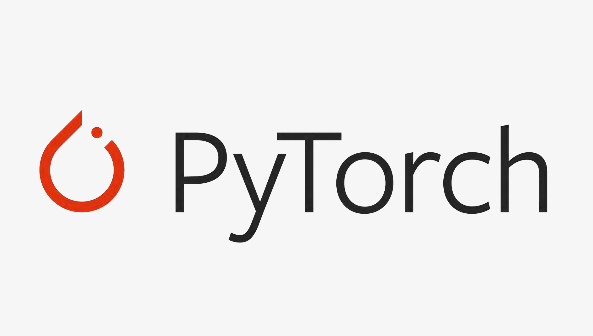

# Paper Reimplementations

Reimplementations of Machine Learning and Artificial Intelligence research papers, mainly using **PyTorch**.

  

The goal is to understand the models by implementing their main components from scratch and experimenting with them, rather than relying only on existing implementations.

## Papers
| # | Implementation | Original Paper | Area | Status |
|---|---|---|---|---|
| 01 | [Sequence to Sequence Learning](./01_Sequence_to_Sequence_Learning) | [Sutskever et al. (2014)](https://arxiv.org/abs/1409.3215) | NLP | 🟢 Completed |
| 02 | [Attention Is All You Need](./02_Attention_Is_All_You_Need) | [Vaswani et al. (2017)](https://arxiv.org/abs/1706.03762) | Transformers / NLP | 🟢 Completed |
| 03 | [Predicting Issue Types with seBERT](./03_Predicting_Issue_Types_with_seBERT) | [Trautsch & Herbold (2022)](https://arxiv.org/abs/2205.01335) | NLP |  🟢 Completed |
| 04 | [An Image Is Worth 16x16 Words](./04_An_Image_Is_Worth_16x16_Words) | [Dosovitskiy et al. (2020)](https://arxiv.org/abs/2010.11929) | Computer Vision | 🟡 In Progress |
*(Status legend: 🟢 Completed | 🟡 In Progress | ⚪ Planned)*

## Focus Areas

- Deep Learning
- Natural Language Processing
- Transformers
- Computer Vision
- Reinforcement Learning

